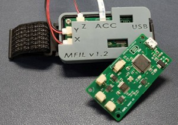

# RCWS Module Firmware Repo

## Introduction

The RCWS module is electrically composed of a main board and a sensor board, with the sensor board mounted on a ring structure so that the user can wear it on their index finger. This module is capable of receiving and decoding specific PWM commands and converting them into actual PWM signals to drive an actuator—specifically, a Linear Resonant Actuator (LRA) that is also mounted on the ring—thereby generating vibrations transmitted to the user’s fingertip. These vibrations can also be quantified by the accelerometer on the sensor board through time-domain acceleration analysis.

|            Ring            |               Main Board               |          Wearing Diagram           |
| :------------------------: | :------------------------------------: | :--------------------------------: |
|  |  |  |

## Hardware

- STM32 F412RxT6 MCU
- DRV2605L LRA driver IC
- MPU 6500 IMU (reserved)
- LRA VG1040003D

## Compilation and Flashing Requirements

**Equipment**

- STLINK-V3SET
- TC2030-CTX-NL (cable)
- STM32CubeIDE 1.18.0 (recommended)
- STM32CubeMX 6.14.0
- STM32Cube FW_F4 V1.28.1

**Procedure**

[](https://youtu.be/gNEbtw4P7_A)  
**[Watch on YouTube](https://youtu.be/gNEbtw4P7_A)**

The procedure is as follows:

1. **Clone the repository:**

   ```bash
   git clone https://github.com/Dennis40816/rcws_stm32_firmware.git
   ```

2. **Import the downloaded folder into STM32CubeIDE.**
3. **Open `main.c`.**
4. **Click on `Generate Code`.**

   

5. **Click on `build` and wait for the compilation to complete.**
6. **After compilation, verify that the compiled size matches the image below:**

   

7. **To flash the RCWS, first configure the run configuration or debug configuration in STM32CubeIDE. After configuring, select Debug and then Run.**

   

8. **Refer to the images below to connect the STLINK-V3SET to the RCWS.**

   | **STLINK-V3 ⬌ TC2030** |            **Overview**            |      **TC2030 ⬌ main board**       |
   | :--------------------: | :--------------------------------: | :--------------------------------: |
   |  |  |  |

9. **Click on `Debug As` or `Run As`.**

   

10. **Flashing complete!!**

## Trouble Shooting

> **I cannot open my STM32CubeIDE workspace?**

Ensure that your current directory path does not contain any non-English characters. If it does, please select a different path.

> **"-l:libarm_cortexM4lf_math.a" not found**

This issue occurs because the file `Middlewares\ST\ARM\DSP\Lib\libarm_cortexM4lf_math.a` was not generated properly by the compiler. Please ensure that you have clicked on `Generate Code`. If there is no response after clicking, verify that you have installed STM32Cube FW_F4 V1.28.1.

> [!Tip]
> You can download it in STM32CubeIDE via **Help ➞ Configuration Tool ➞ Manage Embedded Software Packages**.

> **Unable to see the compiled RAM size (Build Analyzer not displaying)?**

Refer to the STM forum article [Can't see memory usage at Build Analyzer](https://community.st.com/t5/stm32cubeide-mcus/can-t-see-memory-uage-at-build-analyzer/m-p/665295/highlight/true#M26558) for configuration instructions.

## Others

- The C++ program for controlling the RCWS module can be found at [rcws_host](https://github.com/Dennis40816/rcws_host).
